# CS506 12/10 Final Report

Note: use python version 3.9 - 3.11.
To run the code:

```
make install
make run

```

In the jupyter notebook instance, open the file ` CS506_Final_Project_Organized.ipynb`, and select “Cell” - “Run All” to run all code.

# Introduction

In this write up, we will detail our experiments in exploring the iteration between stock movement data, option data, and current events; more specifically, on the creation of a model that, given an aggregate of news headlines from various sources and the calculated sentiments associated with each, will output a series of predictions on the prices of future stock open and close figures. We will step through the engineering decisions from feature extraction to model selection, and explain how each of these components ultimately helped our goal of predicting future stock prices. Finally, we will explain the developments of our findings, and interpret our learnings and results. Ultimately, a final model, with the ability to estimate future stock prices with a precision of up to 0.1 mean squared error, was created and implemented.

Since the midterm, significant progress has been made in refining our methodology and improving the accuracy of our predictions. We have solidified our data acquisition system, which allowed collection of a robust dataset that helps create a comprehensive data set for training. We also were able to conduct further exploratory data analysis, revealing more patterns in the dataset we could utilize.

On the modeling front, we have expanded past the basic linear regression models we used during the midterm report to instead explore models that can capture more complex data. This has allowed us to improve our model and its accuracy, as well as explore how we can predict future stock prices based on historical data.

# Data and Methodology

## Data Scraping and APIs

Firstly, we addressed the first goalpost of interpreting current events. Originally, our objective was to obtain a series of current events by writing a program to web-scrape various notable technological journals, including sources like Financial Times, Forbes, New York Times, Reuters. We intended to obtain key headlines related to each of their technology articles (most news-sources have tags that tie each article towards a category), and calculate the sentiment of both the headlines and the bodies of each article. In this way, we could explore how the headlines interact with future stock prices.

Ultimately, we decided to focus our efforts on the Alpha Vantage API. This API provides an endpoint that returns "live and historical news & sentiment data from a large & growing selection of premier news outlets around the world." By using this API, we could obtain, in large quantities, key news articles and their associated sentiment data pre-calculated. Thus, not only reducing the total amount of time we would've spent having to parse through and classify the headlines ourselves, but, most importantly, giving us a rather simple way to collect a plethora of different news article headlines seamlessly.

However, this is not to say there weren't any challenges posed by this decision. The most notable of which was the restrictions API Vantage imposed on its users. As previously mentioned during the midterm report, the news sentiment query only allows for a limit of 1000 news articles and sentiments to be scraped at a time. This coupled with the fact that any given API key/user may only execute 25 queries per day meant that we had to find other workarounds to collect an adequate amount of data. As such, we had to break down our time frame of one year into multiple different smaller time frames and run a query on each one. After lots of testing, we eventually found the best way was to collect 50 news headlines with their respective sentiments per day (resulting in about 25 days per API key). After collecting each individual 25 days components, we merged them into the final news sentiment dataframe. The final news sentiment data frame being roughly 18300 news articles.

After we obtained a year's worth of stock data, merged it with our obtained stock data, and parsed the data, it resulted with 164 rows and 10 columns:

- Dates: the dates associaed with each price and sentiment.
- Adj Close, High, Low, Open: Financial data (adjusted close, high, low, and open prices).

In financial data, Adj Close, High, Low, and Open are key metrics that are used to analyze the price of an item on the stock market. Open represents for the price of the stock at the beginning of the day. High and Low both are the highest and lowest price the stock reaches throughout the day. Finally, Adjusted Close is the closing price of a stock that has been adjusted to account for various stock movements, such as stock splits, dividends, and other necessary adjustments. In our model, we look to calculate adjusted close, because it reflects the stock's value while accounting for events that can change the share price over time.

- aggregate_sentiment_mean, aggregate_sentiment_median, aggregate_sentiment_std: Statistical metrics for sentiment aggregation.

Aggregate sentiment is calculated by taking the mean of each day of sentiment. For each news article obtained by the API, the aggregate sentiment mean, median and standard deviation is calculated based off the reported sentiment of each article.

- TargetNextClose: The next adjusted close price.

Given that our goal is to calculate the price of the next day, we include a column titled TargetNextClose, which is simply the adjusted close of the stock for the next day within our historical dataset.

- Target, TargetClass: Numerical and categorical targets, respectively.

Finally, we have two features that help enumerate the aspects of the prediction. TargetClass holds a binary 0 or a 1, indicating whether or not the the price of the next day increased or decreased. Target represents the difference in price of Adjusted Close between the days. It is calculated by taking the difference between TargetNextClose and Adj. Close.

## Exploratory Data Analysis

In inspecting how these interact with our target, the predicted next adjusted close price, we explore the correlations and patterns within the data.

### Price and Sentiment

We can see the sentiment and price against time. Notably, the sentiment spikes and varies greatly, while the price reflects a relatively normal "well-performing" ticker, where it fluctuates and generally, slowly incresaes. However, the sentiment spikes, and falls very dramatically, a maybe expected pattern when considering how typically, the news articles will be more alarmist.

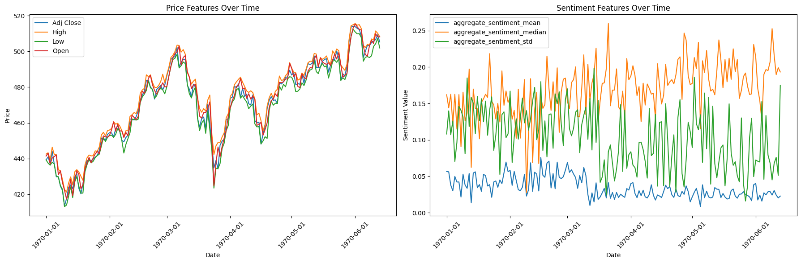

We would also like to compare how these ticker prices interact, and hopefully find some sort of correlation in order to create these predictions. After scaling, we see:

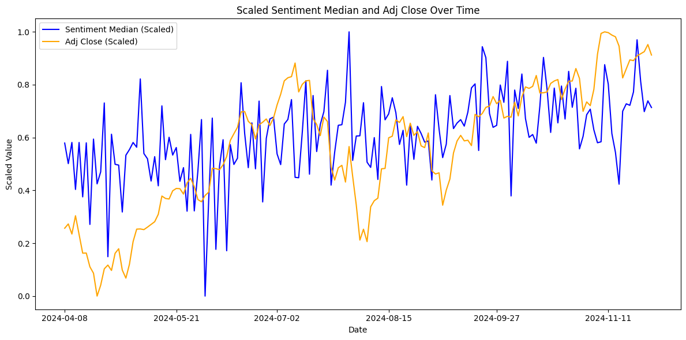

More importantly, we want to see a numerical correlation between the two of these figures:

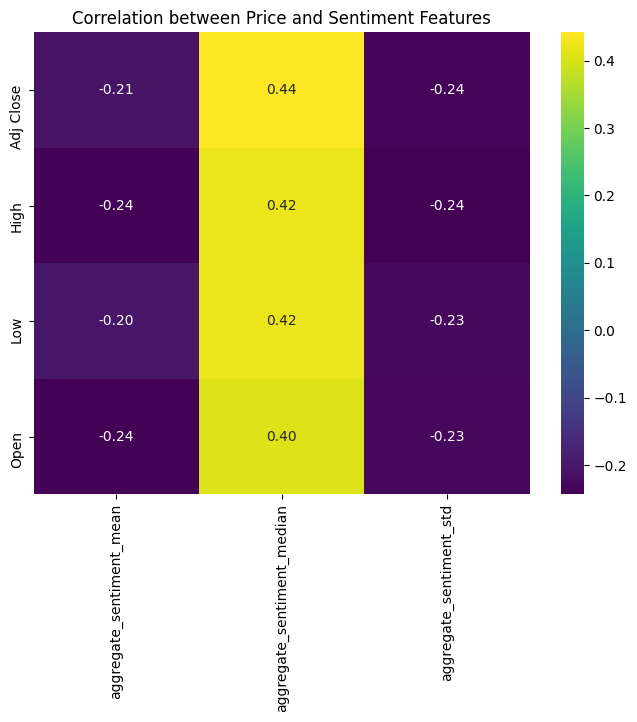

We observe that average sentiment median has a high correlation to price.

### Target

However, despite knowing how the aggregate sentiment median interacts with the current day's newscycle, our goal is to predict future adjusted closing prices. Therefore, it makes sense to instead evaluate the correlation between the sentiment and the next day's price; which is contained in a column titled TargetNextClose. Specifically, we want the change in the price between consecutive days; this is the data contained in Target.

The following plot showcases Target and Sentiment against Dates:

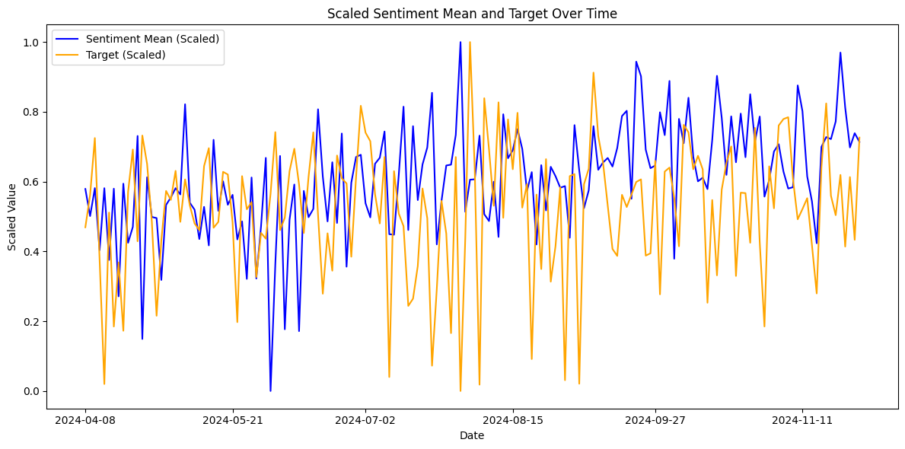

Ultimately, the target also seems to fluctuate greatly; each small change in price within the adjusted close price is reflected at a larger scale due to scaling both the sentiment and target to the same scale. However, we can still see that the sentiment shados the target. It is this relationship that we hope to explore with our model.

# Model Analysis

A couple of different models were tested before finally settling on the Neural Network model, and even then, multiple iterations of the Neural Network model were created before the final result.

Early iterations of our model included linear regression as a baseline. We see a very simple fit, with a Mean Squared Error of 6784.357.

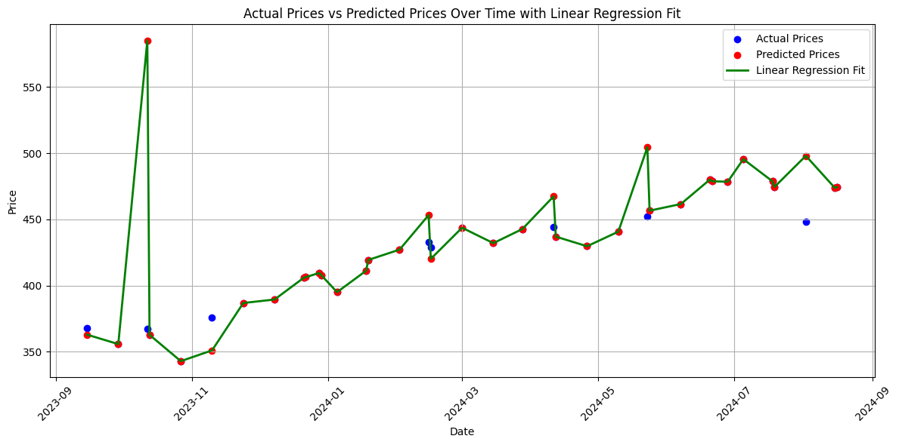

It was clear that a simple linear regression model was not going to be sufficient. Next, a Decision Tree Regressor was used. Decision Trees can capture a high amount of complexity while minimizing variance in the target variable within each partition, resulting in a model that can effectively predict continuous values. It is also a relatively easy model to implement, not requiring an incredibly high amount of data. Nevertheless, the Decision Tree model managed a Mean Squared Error of **1828.826**. While this marked a significant improvement over the linear regression model, it had insufficient accuracy. Specifically, it seemed to have very random variances.

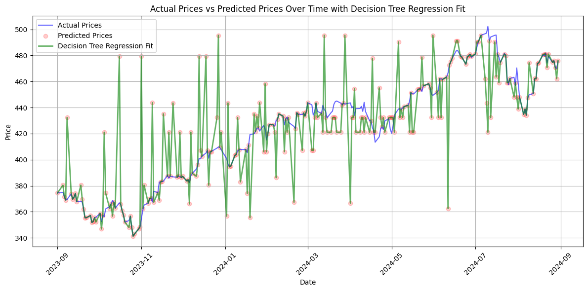

The next model we tested was a XGBoost regression model. We decided to use XGBoost as it is known for being both computationally efficient and working well with structured data. Additionally, we both had experience using it before during the midterm and other classes. As seen from the graph above, the model does a very good job of predicting the adjusted close price of the stock per day with a mean squared error of **53.53** on the test set.

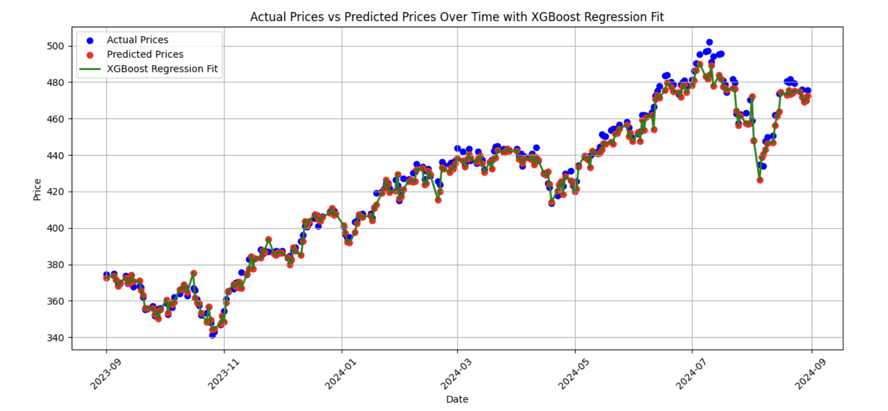

Due to the XGBoost regression model’s high accuracy, we decided to move forward with making this our final model – by attempting to use it in practice by predicting the adjusted closing prices for December 9 to 13, 2024. However, that was when we came to glaring, and in hindsight rather obvious realization, that all of the models so far are technically unable to predict future stock closing prices. This can primarily be attributed to the fact that the models currently rely on sentiment data as well as other stock data, such as the open and high/low prices, in order to determine the adjusted close price. The sentiment data and the latter data of which are dependent on the fluctuations of the stock price throughout the entire day. As such, a user wouldn’t have access to that data unless they were able to see the future. Hence, we had to revise our entire model to get it to predict future prices.

Hence, the remaining sections in the method analysis section will detail the final models we created in order to predict future stock prices from a given date using only data from before those days. These models are LSTM models.

We decided to use a LSTM (Long Short-Term Memory) model, which is particularly well-suited for time series data due to its ability to capture long-term dependencies and patterns in sequential temporal data. LSTM is a recurrent neural network designed to capture long term dependencies in the data. In fact, one dimension in the training data it takes is timesteps. Considering the fact that stock prices are inherently time-series data dependent on historical trends and patterns. This meant that LSTMs seemed like a good choice to use to create our model.

Firstly, we decided on creating a model that predicts only the next day stock price given the following values from the current day:
Adjusted close
High
Low
Open
RSI
EMAF, EMAM, EMAS
Aggregate_sentiment_mean, aggregate_sentiment_median, aggregate_sentiment_std

For this model, we decided to add the features of RSI, EMAF, EMAM, and EMAS. These features are common technical analysis methods that are used to analyze stocks. Relative Strength Index (RSI), is used to “measure the magnitude of recent price changes” to determine if the stock was overbought or oversold. The next three features are different exponential moving averages used to analyze trends over varying date ranges lengths of 20, 100, and 150 respectively. It is also worth noting that by including these exponential moving averages indicators, it understandably reduced our dataset by quite a bit (down to about 166 from 320). This is because it uses data from the aforementioned time frames. As for the specific amount of timesteps we decided to use, it ended up being about 30 days. This number was chosen rather arbitrarily based on when we did research for the model. However, after some testing ,we decided to stick with it. We decided to first create a model to predict the next day’s stock price as this maximizes the amount of data the model will use to predict the upcoming day’s price.

After training the model, and testing it on the months of October and November, we tested it on the data for the following two months worth of data that it was not trained on to determine how it faris. On the testing set, the model achieved a mean squared error of **0.18**, which does not seem too bad to take individually. However, when taken into consideration with the graph below, we can see that it seems to do a pretty poor job of predicting the trend.

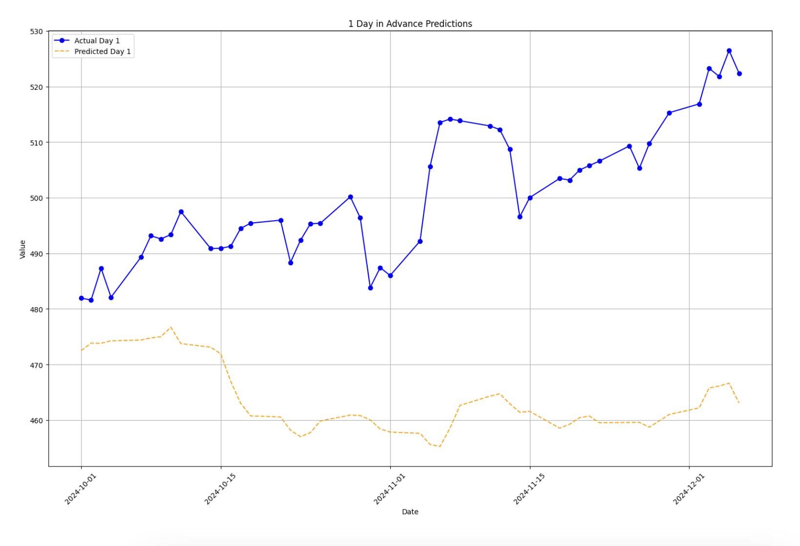

In order to further enhance our potential ability to predict more days in the future, we decided to make our model predict up to 5 days in advance. This was achieved by adding 4 more columns into each date by shifting the next date’s adjusted close to TargetNext(X)Day close column. Although we are undoubtedly losing out on more data, as it was only about 4 days and it would allow us to predict a business week’s worth of stock, we decided to pursue it. Similarly to the previous model, we included the same training data for the 5 day predictive model. This time, the model reached a mean squared error of about 0.103, but it tended to fluctuate between 0.09-0.15. As such, it should work pretty well, however, after plotting it out, there’s definitely aspects that can be improved.

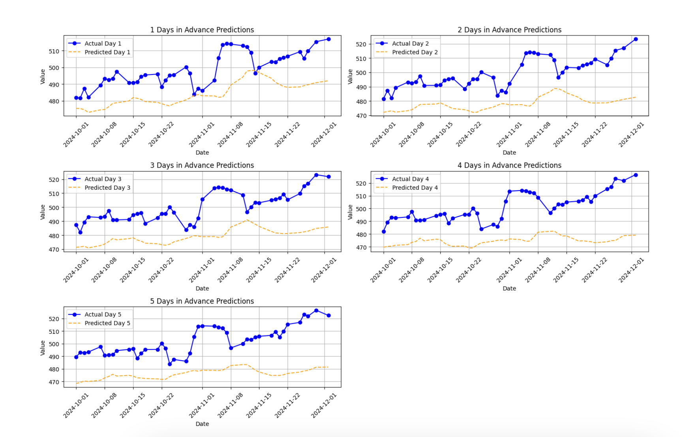

<!-- After preprocessing the data (including scaling, feature engineering, and splitting it into train and test sets), the LSTM model was trained to predict the next target. This approach proved to be significantly better than the earlier models. The LSTM captured the sequential nature of the financial data more accurately, leading to an MSE of **0.2**. This represented a substantial improvement over both linear regression and the decision tree regressor. The plot below compares the predicted values with the actual values, showing a much closer alignment and better trend-following capability. However, some deviations were still observed. -->

We attempted to enhance our model by assigning weights to the sentiment values from different sources. These weights were adjusted based on the alignment of each source's sentiment with actual price changes. When a source’s positive sentiment coincided with a price increase on a given day, its weight was increased. Similarly, when a source’s negative sentiment aligned with a price decrease, its weight was reduced. This approach allowed the model to assess the reliability of each source in predicting future price movements. Testing this method on data from July 1st to September 1st yielded promising results, with a significantly improved Mean Squared Error (MSE) of 0.00583.

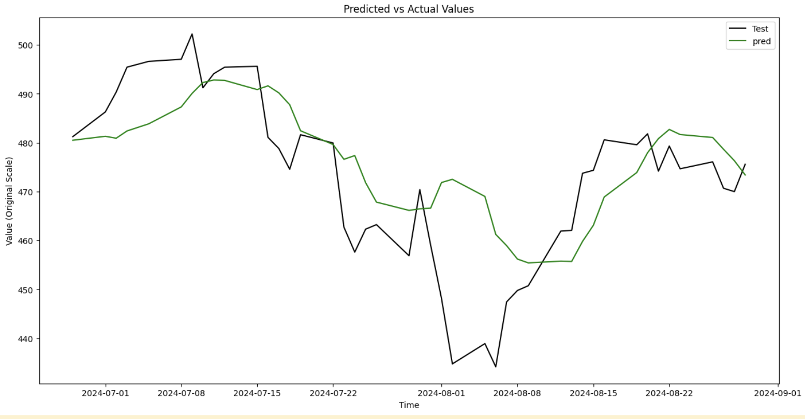

However, while it was a very strong score, the MSE value was suspiciously low, leading us to conclude that the model was overfitting too strongly. Furthermore, when applied to data from October 1st to December 1st, the model showed strong accuracy in predicting one day ahead but became progressively less accurate for longer-term predictions.

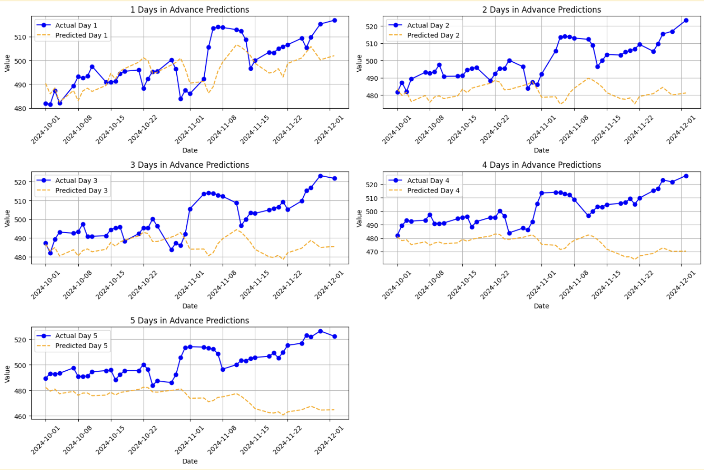

Ultimately, the MSE was comparable to or only slightly better than the model without sentiment weights, with the improvement being negligible. As a result, we decided to proceed without incorporating weighted sentiment into the model.

# Results

Thus, our analysis reveals that our LSTM Neural Network model predicting 5 days in the future is best suited for a real world use case. These findings ultimately highlight the importance of selecting models that align with the underlying structure of the data and the specific requirements of the prediction task, as well as understanding how the model will ultimately be used. While the earlier models provided valuable insights and benchmarks, the LSTM's performance underscores its potential for real-world applications in stock market prediction.

## Challenges

The biggest challenge we faced throughout our project was ultimately our data acquisition. Primarily, the fact that we were continuously rate limited by the API proved to be an issue that was difficult to overcome. We did attempt to further increase our dataset size through adding indicators(RSI, EMA, etc), as well as going back to scrape more days(an additional 3 months). However, in the future, if we were to modify our code again, it would be prudent to expand our dataset even further.

## Conclusion

With our model, we were able to continue to predict future data. We decided to predict the next 5 days of data during the week of this report submission: Between 12-09 to 12-13. Our model states that, based on the last week of technology news articles, QQQ is a sell, and will trend downwards.

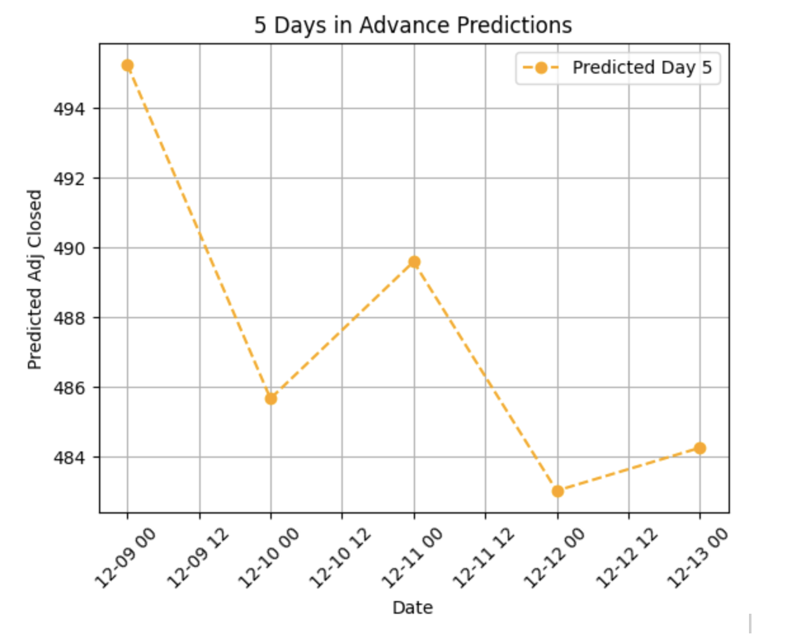
