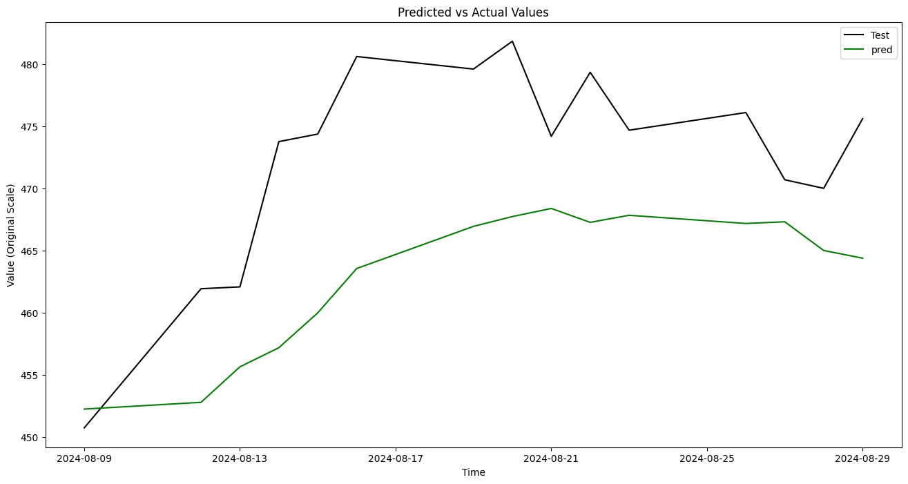

# CS506 12/10 Final Report

To run the code:

##### TODO

<ol>
<li>Create Makefile, guide on how to run the program</li>
<li>Finish the model</li>
<li>Write the rest of this report</li>

</ol>

# Introduction

In this write up, we will detail our experiments in exploring the iteration between stock movement data, option data, and current events; more specifically, on the creation of a model that, given an aggregate of news headlines from various sources and the calculated sentiments associated with each, will output a series of predictions on the prices of future stock open and close figures. We will step through the engineering decisions from feature extraction to model selection, and explain how each of these components ultimately helped our goal of predicting future stock prices. Finally, we will explain the developments of our findings, and interpret our learnings and results.

(We ultimately were able to do xyz. )

# Data and Methodology

## Data Scraping and APIs

Firstly, we addressed the first goalpost of interpreting current events. Originally, our objective was to obtain a series of current events by writing a program to web-scrape various notable technological journals, including sources like Financial Times, Forbes, New York Times, Reuters. We intended to obtain key headlines related to each of their technology articles (most news-sources have tags that tie each article towards a category), and calculate the sentiment of both the headlines and the bodies of each article. In this way, we could explore how the headlines interact with future stock prices.

Ultimately, we decided to focus our efforts on, the Alpha Vantage API. This API provides an endpoint that returns "live and historical news & sentiment data from a large & growing selection of premier news outlets around the world." By using this API, we could obtain, in large quantities, key news articles and their associated sentiment data pre-calculated. Thus, not only reducing the total amount of time we would've spent having to parse through and classify the headlines ourselves, but, most importantly, giving us a rather simple way to collect a plethora of different news article headlines seemlessly.

However, this is not to say there weren't any challenges posed by this decision. The most notable of which was the restrictions API Vantage imposed on its users. As previously mentioned during the midterm report, the news sentiment query only allows for a limit of 1000 news articles and sentiments to be scraped at a time. This coupled with the fact that any given API key/user may only execute 25 queries per day meant that we had to find other workarounds to collect a adequate amount of data. As such, we had to break down our time frame of one year into multiple different smaller time frames and run a query on each one. After lots of testing, we eventually found the best way was to collect 50 news headlines with their respecitive sentiments per day (resulting in about 25 days per API key). After collecting each individual roughly 25 days components, we merged them into the final news sentiment dataframe. The final news sentiment dataframe being roughly 18300 news articles.

However, after we obtained a year's worth of stock data, merged it with our obtained stock data, and parsed the data, it resulted with 164 rows and 10 columns:

- Dates: the dates associaed with each price and sentiment.
- Adj Close, High, Low, Open: Financial data (adjusted close, high, low, and open prices).

In financial data,Adj Close, High, Low, and Open are key metrics that are used to analyze the price of an item on the stock market. Open represents for the price of the stock at the beginning of the day. High and Low both are the highest and lowest price the stock reaches throughout the day. Finally, Adjusted Close is the closing price of a stock that has been adjusted to account for various stock movements, such as stock splits, dividends, and other necessary adjustments. In our model, we look to calculate adjusted close, because it reflects the stock's value while accounting for events that can change the share price over time.

- aggregate_sentiment_mean, aggregate_sentiment_median, aggregate_sentiment_std: Statistical metrics for sentiment aggregation.

Aggregate sentiment is calculated by taking the mean of each day of sentiment. For each news article obtained by the API, the aggregate sentiment mean, median and standard deviation is calculated based off the reported sentiment of each article.

- TargetNextClose: The next adjusted close price.

Given that our goal is to calculate the price of the next day, we include a column titled TargetNextClose, which is simply the adjusted close of the stock for the next day within our historical dataset.

- Target, TargetClass: Numerical and categorical targets, respectively.

Finally, we have two features that help enumerate the aspects of the prediction. TargetClass holds a binary 0 or a 1, indicating whether or not the the price of the next day increased or decreased. Target represents the difference in price of Adjusted Close between the days. It is calculated by taking the difference between TargetNextClose and Adj. Close.

## Exploratory Data Analysis

In inspecting how these interact with our target, the predicted next adjusted close price, we explore the correlations and patterns within the data.

### Price and Sentiment

We can see the sentiment and price against time. Notably, the sentiment spikes and varies greatly, while the price reflects a relatively normal "well-performing" ticker, where it fluctuates and generally, slowly incresaes. However, the sentiment spikes, and falls very dramatically, a maybe expected pattern when considering how typically, the news articles will be more alarmist.

We would also like to compare how these ticker prices interact, and hopefully find some sort of correlation in order to create these predictions. After scaling, we see:

More importantly, we want to see a numerical correlation between the two of these figures:

We observe that average sentiment median has a decently high correlation to price.

### Target

However, despite knowing how the aggregiate sentiment median interacts with the current day's newscycle, our goal is to predict future adjusted closing prices. Therefore, it makes sense to instead evaluate the correlation between the sentiment and the _next_ day's price; which is contained in a column titled TargetNextClose. Specifically, we want the change in the price between consecutive days; this is the data contained in Target.

The following plot showcases Target and Sentiment against Dates:

Ultimately, the target also seems to fluctuate greatly; each small change in price within the adjusted close price is reflected at a larger scale due to scaling both the sentiment and target to the same scale. However, we can still imagine that the sentiment seems to shadow the target. It is this relationship that we hope to explore with our model.

# Model Analysis

A couple of different models were tested before finally settling on the Neural Network model, and even then, multiple iterations of the Neural Network model were created before the final result.

Early iterations of our model included linear regression as a baseline. We see a very simple fit, with a Mean Squared Error of **6784.357** and R-squared of **-4.503**.

It was clear that a simple linear regression model was not going to be sufficient. Next, a Decision Tree Regressor was used. Decision Trees can capture high amount of complexity while minimizing variance in the target variable within each partition, resulting in a model that can effectively predict continuous values. It is also a relatively easy model to implement, not requiring an incredibly high amount of data. Nevertheless, the Decision Tree model managed a Mean Squared Error of **1828.826** and a R-squared of **-0.102**. While this marked a significant improvement over the linear regression model, it had insufficient accuracy. Specifically, it seemed to have very random variances.

We moved on to an LSTM (Long Short-Term Memory) Neural Network model, which is particularly well-suited for time series data due to its ability to capture long-term dependencies and patterns in sequential data. After preprocessing the data (including scaling, feature engineering, and splitting it into train and test sets), the LSTM model was trained to predict the next target. This approach proved to be significantly better than the earlier models. The LSTM captured the sequential nature of the financial data, leading to a Mean Squared Error of **0.02478**. This represented a substantial improvement over both linear regression and the decision tree regressor. The plot below compares the predicted values with the actual values, showing a much closer alignment and better trend-following capability. However, some deviations were still observed.

# Results
