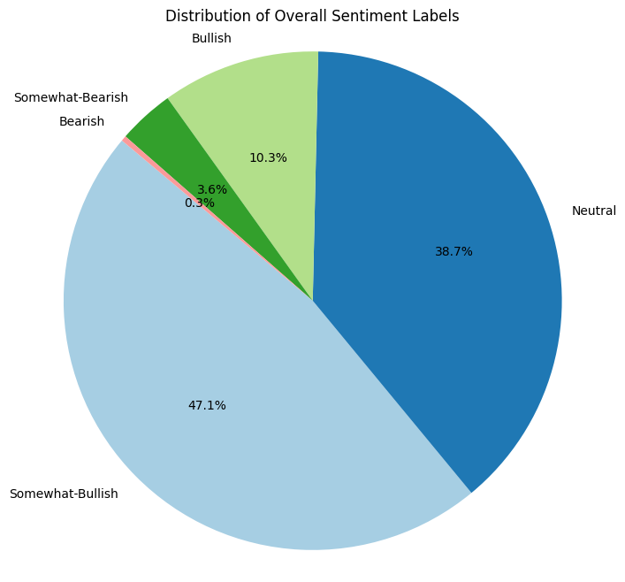

# CS506 11/15 Midterm Report

##### to be added to readme once written :)

In the past month, we have analyzed and established a plan to explore stock prices in the technology field by exploring the iteration between stock movement data, option data, and current events.

We've done preliminary analysis on some of the sources we can use to actually construct our model. Of note, not all of the available news sources will be able to provide us a sufficient amount of data to use in training. While we intend to use an aggregate of multiple News APIs to construct our final training set, for our current intermediary testing, we have ruled out some sources of data.

We have decided on predicting a precise ticker: **QQQ**. This will allow us to precisely train on the tech subset of the news headlines, simplifying the training process, as QQQ tracks specifically technology companies' prices.

### Stock Market Data

We have decided on predicting a precise ticker: **QQQ**. This will allow us to precisely train on the tech subset of the news headlines, simplifying the training process, as **QQQ** tracks the Nasdaq-100 Index that includes the 100 largest non-financial companies listed on NasDaq. 50% of the stocks on Nasdaq are classifed as tech stocks according to US News. 

To obtain stock ticker numbers from market data in the past year, we use the Yahoo Finance API. This allows us to obtain all prices from **QQQ** in the past year. Although the amount of data within one year may be considered quite little, it should be sufficent to determine patterns. Below is a plotted image of the stock data over time

### Financial Headline Data

For now, we focus our efforts on processing data from Alpha Vantage API. Although each call gives us a large quantity of usable data, including sentiment analysis and relevancy of each given news article and headline, there were a few problems posed by this. Most notably, the news sentiment query only allows for a limit of 1000 news articles and sentiments to be scraped at a time. As such, we had to break down our time frame of one year into multiple different smaller time frames and run a query on each one. To maximize the potential amount of scrapable data, we decided to break it into time frames of 6 days each, since 366 is divisible by 6. However, this led to the issue of being  rate limited by the free API which restricts it to a limit of 25 API requests per day. Thus, currently, the amount of data we scraped is through the use of bi-weekly time frames. As for the specific columns of data we decided to keep, they are as follows:
- title
- url
- time_published
- source
- overall_sentiment_score
- overall_sentiment_label
- ticker_sentiment
Overall sentiment_score x and label are defined as x <= -0.35: Bearish; -0.35 < x <= -0.15: Somewhat-Bearish; -0.15 < x < 0.15: Neutral; 0.15 <= x < 0.35: Somewhat_Bullish; x >= 0.35: Bullish , according to the Alpha Vantage API.

The distribution of sentiment scores is as follows:

